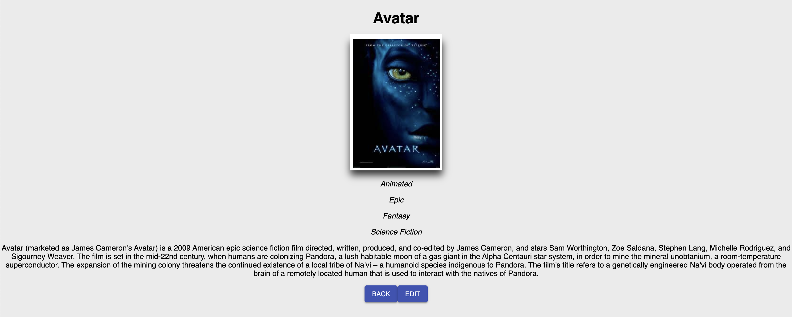
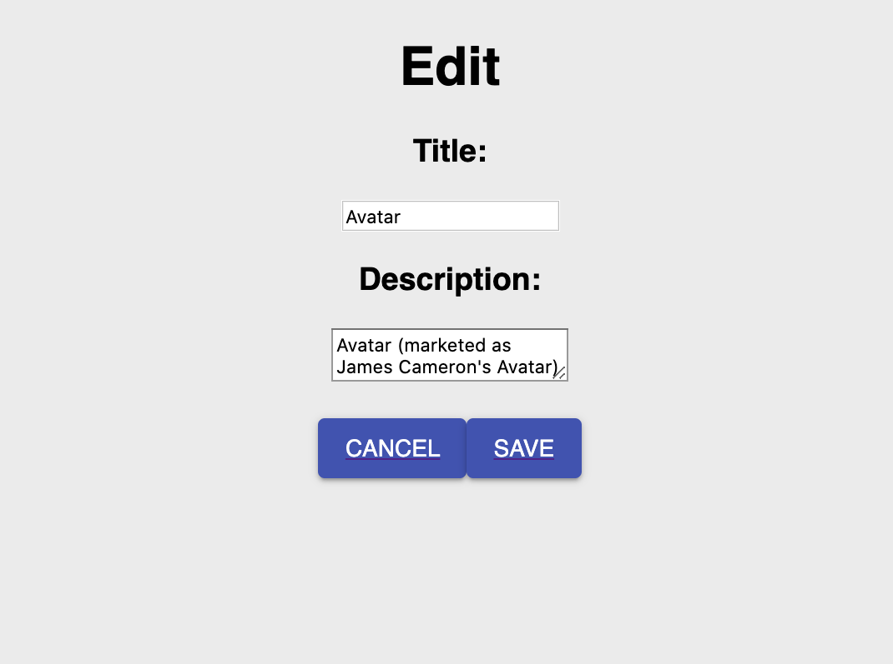

# Movie Collection

This app allows users to click a movie poster and view a description and list of genres associated with the movie. While on the description page, the user is able to either return back to the list of movies or makes edits to the selected movie. Once edits have been made and submitted, the changes are updated in the database and displayed to the DOM.

Genres and movie data were stored in separate table in the database so I created a junction table and used SQL joins in order to select the correct genres for the selected movie.

## Prerequisites

- Node

## Built With

- React

